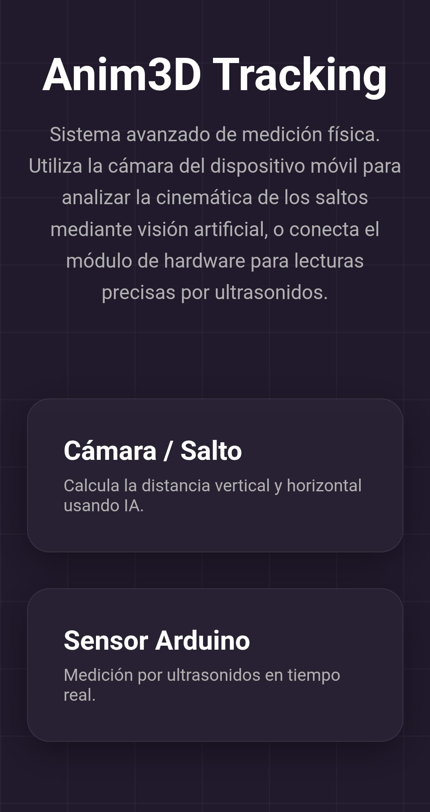
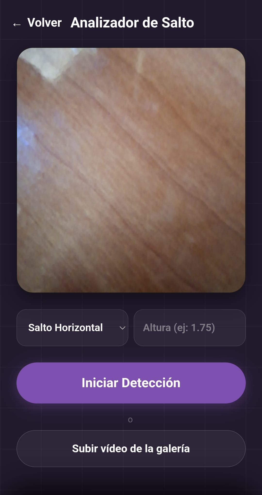
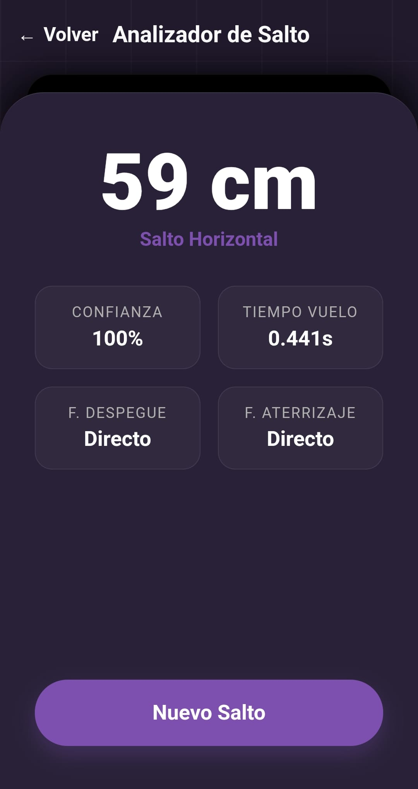
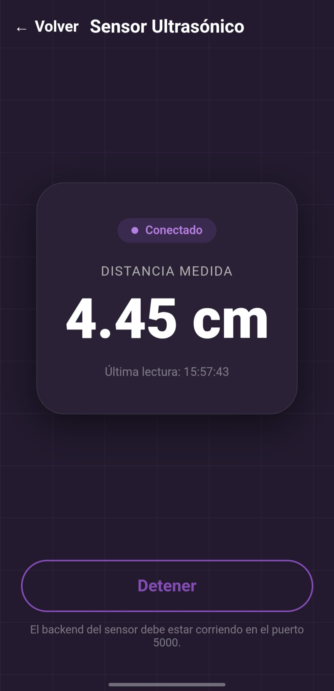

# Integración Web y Backends

Esta guía explica cómo levantar la integración completa (frontend + APIs de salto y sensor) en desarrollo local.

## Opción recomendada (HTTPS)

Desde la raíz del proyecto:

```powershell
scripts\run_all.bat
```

Accede en navegador a:

```text
https://localhost:8443
```

Si quieres usar móvil por LAN, genera antes el certificado local:

```powershell
.\.venv\Scripts\python.exe scripts\generate_cert.py
```

Y abre en el móvil:

```text
https://TU_IP_LAN:8443
```

## Opción manual

### Backend salto

```powershell
cd modules\salto\backend
python app.py
```

### Backend sensor

```powershell
cd modules\sensor\backend
python app.py
```

### Frontend HTTPS

```powershell
cd .
python scripts\https_server.py
```

## Modo HTTP (compatibilidad)

También puedes servir frontend en HTTP para pruebas legacy:

```powershell
cd integration\web
python -m http.server 8080
```

URL:

```text
http://localhost:8080
```

Importante: los backends arrancan en HTTPS automáticamente si existen los certificados en `certs/`. Si necesitas un entorno totalmente HTTP, arranca sin certificados locales.

## Resolución de problemas rápida

- Si no carga cámara en móvil: usa HTTPS (`https://...`) en lugar de HTTP.
- Si falla conexión al backend desde frontend: revisa protocolo y puerto (5000 sensor, 5001 salto).
- Si cambias de red y falla HTTPS LAN: regenera certificado con `scripts/generate_cert.py`.

## Interfaz gráfica

| Pantalla de inicio | Cámara en vivo |
| :---: | :---: |
|  |  |
| **Resultados del análisis** | **Monitor del sensor ultrasónico** |
|  |  |
